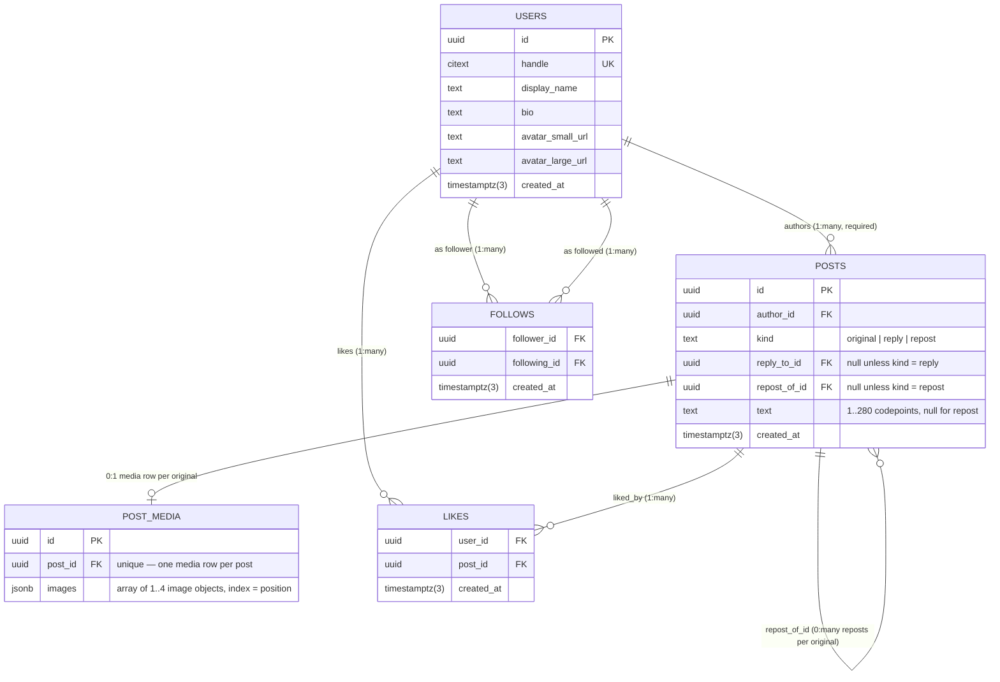

# ERD — Social Feed

## Entities

| Entity | Purpose |
|---|---|
| `users` | Account/profile identity. Public handle is unique, case-insensitive. |
| `posts` | Originals, replies and reposts — one table, discriminated by `kind`. |
| `post_media` | One row per original post holding a `jsonb` array of 1–4 images (url variants and alt text). |
| `likes` | Association row: one user liking one post, once. |
| `follows` | Directional association row: one user following another. |

**Why one `posts` table instead of a separate `comments`/`reposts` table?**
See `decisions.md` — short version: replies and reposts both need the full post
identity (author, timestamps, cursor pagination, like counts), and splitting
them would mean three near-identical tables and three feed-cursor
implementations instead of one. The trade-off is a `target_post_id` that is
`NULL` for originals and required for replies/reposts, enforced with a
`CHECK`.

## Cardinality overview



> **Fixture alignment note:** field names above (`text`, `authorId`,
> `replyToId`, `repostOfId`, `displayName`, `smallUrl`/`largeUrl`,
> `followingId`) are taken directly from `backend/src/.../fixtures.ts` and
> the existing `Post` repository type — not invented independently. Using
> the same names as the existing fixture repository/DTOs means PRD 04's
> ORM entity classes can map close to 1:1 onto this schema instead of
> requiring a translation layer between "DB shape" and "app shape."

## Relationships, spelled out with cardinality + optionality

| Relationship | Cardinality | Optionality | Notes |
|---|---|---|---|
| `users` → `posts` (author) | 1 : many | User side optional (0 posts allowed); Post side mandatory (every post has exactly one author) | `posts.author_id NOT NULL REFERENCES users(id)` |
| `posts` (original) → `posts` (reply) | 1 : many, self-referencing | Original side optional (0 replies); child side mandatory when `kind = 'reply'` | `reply_to_id` is `NOT NULL` only for `kind = 'reply'` — enforced by `CHECK`, existence enforced by FK |
| `posts` (original) → `posts` (repost) | 1 : many, self-referencing | Original side optional (0 reposts); child side mandatory when `kind = 'repost'` | `repost_of_id` is `NOT NULL` only for `kind = 'repost'` — same pattern, separate column, mirroring the app's existing `replyToId` / `repostOfId` split rather than one shared `target_post_id` |
| `posts` (original) → `post_media` | 1 : 0..1 | Post side optional (0 or 1 media row — a post with zero images simply has no row); media side mandatory when it exists | One `jsonb` array column (`images`) holds 1–4 image objects; array length IS the "max 4" rule (`CHECK (jsonb_array_length(images) BETWEEN 1 AND 4)`) and array index IS the position — no separate `position` column, no way to have a gap or a duplicate position |
| `users` ↔ `posts` via `likes` | many : many | Both sides optional | Composite PK `(user_id, post_id)` gives "like once" for free |
| `users` ↔ `users` via `follows` | many : many, directional | Both sides optional | Composite PK `(follower_id, followed_id)` + `CHECK (follower_id <> followed_id)` blocks self-follow |

## `post_media.images` element shape

Each object in the `images` array follows this shape (validated in the
service layer — see below for what the database does and doesn't check):

```json
{
  "small_url": "/fixtures/desk-480.jpg",
  "large_url": "/fixtures/desk-1200.jpg",
  "alt_text": "A desk with a laptop"
}
```

Array index doubles as position — the first object is position 0, the
last (at most the 4th) is position 3. Reordering images is reordering
the array, not updating a `position` column.

**What the database *can* still guarantee** with plain `CHECK`
constraints on the column as a whole (no subquery needed, since these
inspect the array's shape, not each element's field values):
- `jsonb_typeof(images) = 'array'`
- `jsonb_array_length(images) BETWEEN 1 AND 4`

**What moves to the service layer**, and why: validating each element
has a non-empty `alt_text`, positive `width`/`height`, non-empty URLs —
a plain `CHECK` constraint can't loop over `jsonb_array_elements()`
(Postgres disallows subqueries inside `CHECK` expressions entirely, not
just cross-table ones). This is enforced before insert and covered in
`constraint-tests.sql` as a documented service-layer guarantee, not a
database one — same honesty standard as the "reply target must be an
original" rule elsewhere in this schema.

## Reading the diagram

- Every `||--o{` reads "exactly one (required) on the left, zero-or-more
  (optional) on the right" — that's the standard shape for a parent →
  children relationship here (a user always exists before their posts do;
  a post can exist with zero likes).
- The self-referencing `posts ||--o{ posts` edge is the one relationship
  worth double-checking by hand: draw a small example with one original and
  two replies and confirm `target_post_id` on the replies points back to the
  original's `id`, not to each other.
